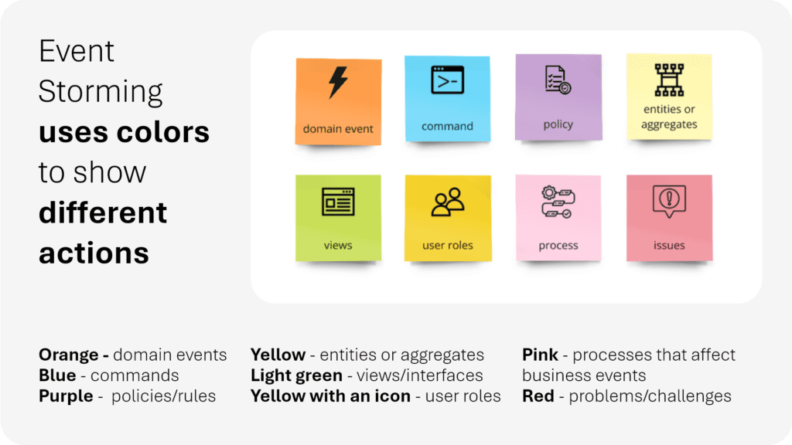
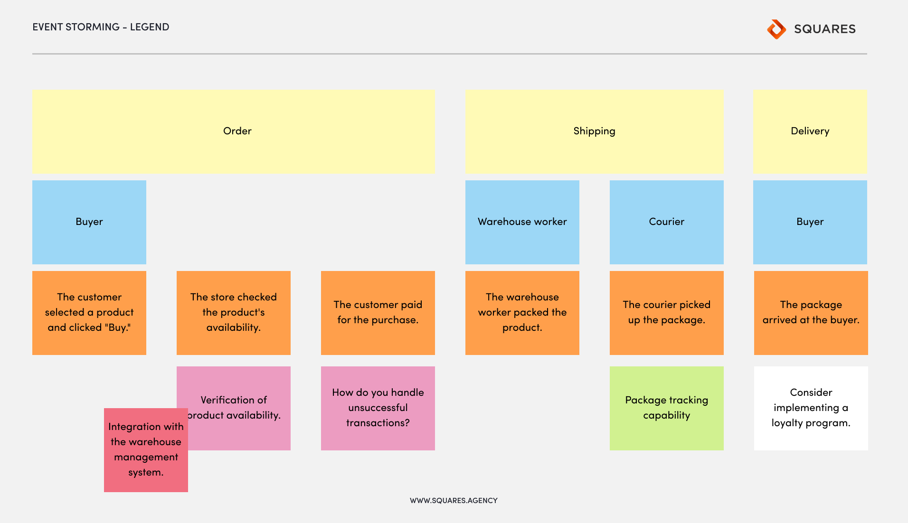
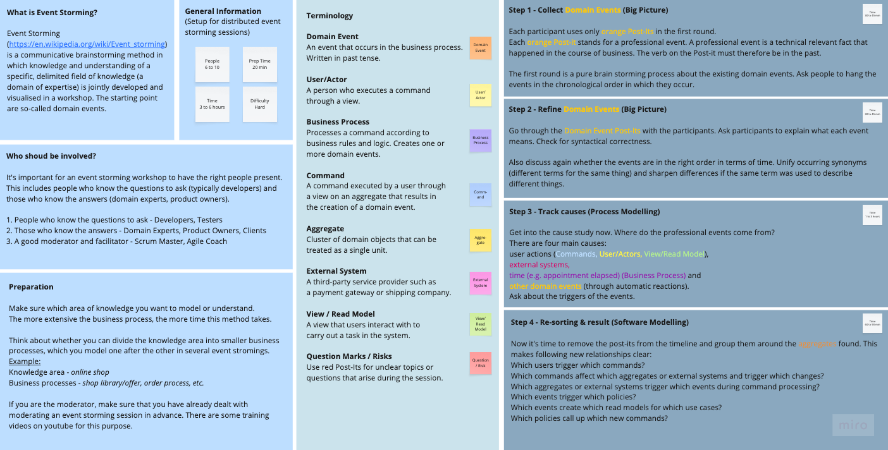
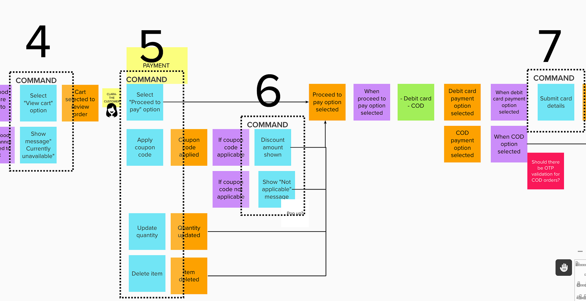

Domain-Driven Design - E-commerce System

Triển khai trong workshop

1. Bắt đầu bằng Event Storming (big picture): liệt kê tất cả Domain Events (OrderPlaced, PaymentFailed, StockReserved, ShipmentDelivered…).
2. Từ events → xác định Aggregates → vẽ boundary → ra Bounded Contexts.
3. Thảo luận Ubiquitous Language cho từng context (tránh dùng chung từ ngữ gây nhầm lẫn, ví dụ: “Product” trong Catalog khác với “Item” trong Order).
4. Quyết định công nghệ: mỗi context có thể là microservice riêng (Spring Boot, .NET, Node…), dùng Kafka/RabbitMQ cho event, gRPC/REST cho synchronous call.

5. Các câu hỏi để làm rõ vấn đề trong workshop (dưới các vai trò khác nhau)
   Trong một workshop áp dụng Domain-Driven Design (DDD) cho hệ thống E-commerce, việc đặt câu hỏi đúng là rất quan trọng để khám phá domain, xây dựng Ubiquitous Language và xác định ranh giới. Tôi phân loại câu hỏi theo các vai trò tham gia điển hình (Domain Expert/Business Stakeholder, Product Owner, Developer/Engineer, Architect/Principal Engineer). Những câu hỏi này thường được sử dụng trong kỹ thuật EventStorming – một phương pháp phổ biến để discovery domain nhanh chóng.
   Vai trò Domain Expert / Business Stakeholder (người hiểu sâu về nghiệp vụ)

- Quy trình mua sắm của khách hàng diễn ra như thế nào từ lúc xem sản phẩm đến nhận hàng?
- Những sự kiện quan trọng (domain events) nào xảy ra trong quy trình? Ví dụ: "Khách hàng thêm sản phẩm vào giỏ", "Đơn hàng được đặt", "Thanh toán thành công", "Hàng được giao"?
- Khi nào thì một sản phẩm được coi là "hết hàng"? Ai quyết định điều đó và dựa trên tiêu chí gì?
- Khái niệm "Đơn hàng" có nghĩa gì chính xác? Nó bao gồm những gì (sản phẩm, giá, khuyến mãi, phí ship)?
- Có những trường hợp ngoại lệ nào thường xảy ra (ví dụ: hủy đơn, hoàn tiền, flash sale)?
  Vai trò Product Owner / Product Manager
- Phần nào của hệ thống mang lại lợi thế cạnh tranh nhất (core domain)? Ví dụ: khuyến mãi cá nhân hóa, quản lý đơn hàng nhanh chóng?
- Những tính năng nào đang gây bottleneck hoặc pain point lớn nhất cho business hiện tại?
- Chúng ta ưu tiên subdomain nào trước (catalog, order, payment)?
- Khi nào một đơn hàng được coi là "hoàn tất" từ góc nhìn business?
- Các chỉ số KPI chính là gì (conversion rate, abandonment cart rate)?
  Vai trò Developer / Software Engineer
- Dữ liệu nào cần được đồng bộ realtime giữa các phần (ví dụ: inventory cập nhật khi đặt hàng)?
- Những command nào kích hoạt sự kiện (ví dụ: "AddToCart" dẫn đến "ItemAddedToCart")?
- Có external system nào tích hợp không (payment gateway như VNPay/MoMo, shipping như GHN/GHTK)?
- Làm thế nào để xử lý concurrency (ví dụ: nhiều khách cùng mua sản phẩm cuối cùng)?
- Aggregate root nào nên chịu trách nhiệm cho consistency (ví dụ: Order là aggregate root chứa OrderItems)?
  Vai trò Principal Engineer / Architect (tôi đang đóng vai này)
- Khái niệm "Product" có cùng nghĩa ở tất cả các phần không? (Ví dụ: trong Catalog thì quan tâm description/image, trong Inventory thì weight/stock/supplier).
- Ranh giới ngôn ngữ thay đổi ở đâu? (Dấu hiệu của Bounded Context mới).
- Chúng ta có thể tách subdomain nào thành service riêng mà không ảnh hưởng lớn?
- Integration giữa các phần nên dùng pattern nào (event-driven, synchronous API, shared database)?
- Có risk nào dẫn đến Big Ball of Mud nếu không định nghĩa rõ boundary?
  Những câu hỏi này giúp khám phá domain events, commands, aggregates, và dần dần xây dựng Ubiquitous Language chung.

2. Phân tích và trình bày EventStorming

- Legend màu sticky notes phổ biến
  - Orange: Domain Event (sự kiện đã xảy ra, past tense: "OrderPlaced", "PaymentSucceeded").
  - Blue: Command (hành động: "PlaceOrder", "AddToCart").
  - Yellow: Aggregate (thực thể chịu trách nhiệm: "Order", "Cart").
  - Green: Policy/Rule (phản ứng: "Whenever OrderPlaced → ReserveInventory").
  - Purple: Read Model / View (dữ liệu hiển thị: "OrderHistoryView").
  - Red/Hot pink: Pain points, questions, issues.
  - Light blue: Actor/User (người thực hiện command: "Customer", "Admin").



- Quy trình chạy Big Picture EventStorming
  _ Chuẩn bị: Bảng lớn (wall) hoặc tool online (Miro, Mural), sticky notes nhiều màu, tất cả stakeholder.
  _ Chaos phase: Mọi người viết càng nhiều Domain Events (orange) càng tốt, dán lung tung lên bảng. Không tranh luận, chỉ brainstorm (thường 100-300 events).
  _ Timeline ordering: Sắp xếp events theo thứ tự thời gian từ trái sang phải → hiện ra business flow.
  _ Thêm Commands (blue) ở trước event tương ứng (nguyên nhân → kết quả).
  _ Thêm Actors (light blue) ở bên trái command.
  _ Phát hiện Pain points (red) và thảo luận. \* Nhóm events thành Bounded Contexts (vẽ đường dọc phân cách).

Step 1 - Collect Domain Events
Step 2 - Refine Domain Events
Step 3 - Track causes
Step 4 - Find aggregates & re-sort them




Ví dụ EventStorming cho E-commerce (Order Management flow)
Một timeline đơn giản cho quy trình mua hàng:
Customer → AddToCart → ItemAddedToCart
Customer → Checkout → OrderPlaced
Order → ReserveInventory → InventoryReserved (hoặc InsufficientStock)
Order → ProcessPayment → PaymentSucceeded
Order → ShipOrder → OrderShipped
Carrier → Deliver → OrderDelivered

3. Phân tích Domain và thiết kế DDD
   Phân tích Domain (E-commerce System)
   Trong DDD, chúng ta chia domain thành:

- Core Subdomain: Phần mang lại lợi thế cạnh tranh (nơi đầu tư nhiều nhất).
- Supporting Subdomain: Hỗ trợ core nhưng không phải lợi thế cạnh tranh.
- Generic Subdomain: Có thể mua giải pháp có sẵn (third-party).
  Đối với E-commerce tiêu chuẩn:
  Loại Subdomain Mô tả Lý do phân loại
  Core Order Fulfillment Quản lý giỏ hàng → đặt hàng → thanh toán → vận chuyển → giao hàng Đây là trải nghiệm khách hàng chính, quyết định chuyển đổi
  Core Catalog & Search Quản lý danh mục sản phẩm, tìm kiếm, gợi ý Trải nghiệm tìm kiếm tốt là lợi thế cạnh tranh lớn
  Core Pricing & Promotion Tính giá động, voucher, flash sale, khuyến mãi cá nhân hóa Rất quan trọng với chiến lược kinh doanh
  Supporting Inventory Management Theo dõi tồn kho, đặt hàng nhập kho, dự báo Quan trọng nhưng có thể dùng giải pháp chuyên sâu
  Supporting Customer Management Đăng ký, profile, lịch sử mua hàng, loyalty Hỗ trợ core nhưng không phải điểm khác biệt lớn
  Supporting Seller Management (nếu marketplace) Quản lý người bán, commission, dispute Hỗ trợ nếu là nền tảng marketplace
  Generic Payment Processing Tích hợp cổng thanh toán (VNPay, Momo, Stripe, PayPal…) Nên dùng third-party, không tự xây
  Generic Shipping & Logistics Tích hợp đơn vị vận chuyển (GHN, GHTK, Ninja Van…) Nên dùng third-party API
  Generic Notification Email, SMS, push notification Có thể dùng dịch vụ như Firebase, SendGrid
  Thiết kế Strategic DDD
  Ubiquitous Language
  Xây dựng ngôn ngữ chung giữa business và dev, sử dụng trong code, discussion, documentation.
- Trong Event Storming: Khi liệt kê Domain Events, hỏi business "Các anh/chị gọi cái này là gì?" → ghi từ đó lên sticky note.
- Tạo Domain Glossary: Một document chung (Confluence/Notion) liệt kê tất cả term + nghĩa + context + ví dụ.
- Phản ánh vào code:
  - Tên class: CartItem, OrderLine, StockReservation.
  - Method: cart.applyVoucher(voucherCode), order.calculateTotalPrice().
  - Không dùng từ generic như "Item" mà không có prefix.
- Review thường xuyên: Mỗi sprint hoặc khi có business change, review lại glossary.
- Anti-pattern cần tránh:
  - Dùng cùng từ cho nghĩa khác (ví dụ gọi chung là "Product" khắp nơi).
  - Dùng từ technical thay vì business (ví dụ gọi "Entity" thay vì "Order").

Ví dụ:

- "Product" → Không chung chung. Trong Catalog: "Product" có title, description, images, categories. Trong Inventory: "Product" có SKU, weight, supplier, stock level. Trong Order: "Product" chỉ có price tại thời điểm đặt, name snapshot.
- "Order" → Là aggregate với states: Draft → Placed → Paid → Shipped → Delivered → Cancelled.
- "Cart" → Giỏ hàng tạm thời, không phải Order.
- Domain Events: "OrderPlaced", "PaymentSucceeded", "InventoryReserved", "OrderShipped".

Bounded Contexts
Mỗi subdomain thường map 1:1 với Bounded Context (lý tưởng). Mỗi BC có model riêng, ubiquitous language riêng.
Bounded Context Subdomain Type Mô tả chính Entities/Aggregates chính Ubiquitous Language ví dụ
Product Catalog Supporting Quản lý danh mục, search, hiển thị sản phẩm Product, Category, Review Product có variants, attributes
Shopping Cart Core Giỏ hàng tạm thời Cart, CartItem Cart expires sau thời gian
Order Management Core Đặt đơn, tính giá, khuyến mãi Order (root), OrderItem, Promotion OrderPlaced event
Inventory Management Supporting Quản lý stock, reservation StockItem, Warehouse InventoryReserved, OutOfStock
Payment Generic Xử lý thanh toán Payment, Transaction PaymentSucceeded/Failed
Shipping Generic Giao hàng, tracking Shipment, Delivery OrderShipped, Delivered
Customer Management Supporting Profile khách hàng, address Customer, Address RegisteredCustomer

- Bounded Context: Catalog Context
  Mục tiêu chính: Quản lý danh mục sản phẩm, thuộc tính, tìm kiếm, hiển thị.
  Pattern Ví dụ cụ thể Mô tả / Lý do sử dụng
  Entity Product, Category Có identity (ProductId, CategoryId) và lifecycle thay đổi (cập nhật tên, mô tả).
  Value Object ProductAttribute (color, size), Money (giá hiển thị), SeoMetadata Immutable, không có identity riêng, dùng để mô tả đặc tính sản phẩm.
  Aggregate Root Product (bao gồm list Variant/SKU, list Attribute) Product là root, tất cả thay đổi (thêm variant, cập nhật attribute) phải qua Product.
  Domain Service ProductSearchService (xử lý full-text search phức tạp), CatalogImportService Khi logic không thuộc về một entity/aggregate (ví dụ: import bulk sản phẩm).
  Repository ProductRepository, CategoryRepository Truy xuất Product bằng ID hoặc query phức tạp (filter theo category, attribute).
  Factory ProductFactory (tạo Product với variants phức tạp) Khi việc tạo Product có nhiều bước validation và cấu hình default.
  Domain Event ProductCreated, ProductUpdated, ProductPriceChanged, ProductOutOfStock Publish khi sản phẩm thay đổi để các context khác (Pricing, Inventory, Cart) phản ứng.

- Bounded Context: Pricing & Promotion Context
  Mục tiêu chính: Tính giá động, quản lý voucher, campaign khuyến mãi.
  Pattern Ví dụ cụ thể Mô tả / Lý do sử dụng
  Entity Voucher, PromotionCampaign Có identity và lifecycle (campaign có start/end date, voucher có usage count).
  Value Object DiscountAmount (percent hoặc fixed), PriceRuleCondition, Money Immutable, dùng để định nghĩa quy tắc giảm giá.
  Aggregate Root PromotionCampaign (bao gồm list Rule, list ApplicableProduct) Campaign là root, tất cả thay đổi rule phải qua campaign để đảm bảo consistency.
  Domain Service PricingService (tính tổng giá cho list item với nhiều rule chồng chéo) Logic phức tạp không thuộc aggregate nào (áp dụng nhiều campaign cùng lúc).
  Repository VoucherRepository, CampaignRepository Query voucher hợp lệ, campaign đang active.
  Factory VoucherFactory (tạo voucher batch với code unique) Đảm bảo tạo voucher với mã duy nhất và validation phức tạp.
  Domain Event VoucherApplied, CampaignStarted, CampaignEnded, PriceRecalculated Thông báo để Order/Cart recalculate giá khi có thay đổi promotion.

- Bounded Context: Shopping Cart Context
  Mục tiêu chính: Giỏ hàng tạm thời, áp dụng promotion, tính tổng.
  Pattern Ví dụ cụ thể Mô tả / Lý do sử dụng
  Entity Cart Có identity (CartId, thường gắn với CustomerId hoặc SessionId).
  Value Object CartItem (productId, quantity, unitPrice), AppliedDiscount Immutable snapshot của item tại thời điểm thêm vào giỏ.
  Aggregate Root Cart (bao gồm list CartItem) Cart là root, tất cả thao tác add/remove/update quantity phải qua Cart.
  Domain Service CartPricingService (gọi Pricing Context để tính discount) Phối hợp với context khác để tính giá cuối cùng.
  Repository CartRepository (thường dùng Redis/NoSQL vì transient) Lưu giỏ tạm thời, expire sau thời gian không hoạt động.
  Factory Không thường dùng (Cart đơn giản) Có thể có CartFactory nếu cần restore từ session.
  Domain Event CartItemAdded, CartItemRemoved, CartCheckedOut CartCheckedOut trigger tạo Order trong Order Context.

- Bounded Context: Order Context
  Mục tiêu chính: Quản lý đơn hàng từ đặt → thanh toán → giao → hoàn tất/trả hàng.
  Pattern Ví dụ cụ thể Mô tả / Lý do sử dụng
  Entity Order, OrderLine Order có identity, OrderLine cũng có (nhưng thuộc aggregate).
  Value Object ShippingAddress, Money, OrderStatus (enum-like) Immutable, mô tả trạng thái và thông tin snapshot.
  Aggregate Root Order (bao gồm list OrderLine, PaymentInfo, ShipmentInfo) Order là root – mọi thay đổi (cancel, update address) phải qua Order để kiểm tra state.
  Domain Service OrderPlacementService (phối hợp reserve inventory, calculate price) Logic cross-aggregate/context khi đặt hàng.
  Repository OrderRepository Query order bằng ID, customer, status; hỗ trợ paging cho admin.
  Factory OrderFactory (tạo Order từ Cart, với validation phức tạp) Đảm bảo Order được tạo đúng (snapshot price từ Cart/Pricing).
  Domain Event OrderPlaced, OrderPaid, OrderShipped, OrderCancelled, OrderCompleted Rất nhiều event để trigger Inventory reserve/release, Payment, Fulfillment.

- Bounded Context: Inventory Context
  Mục tiêu chính: Quản lý tồn kho, reservation.
  Pattern Ví dụ cụ thể Mô tả / Lý do sử dụng
  Entity StockItem Có identity (StockItemId = ProductId + WarehouseId).
  Value Object Quantity, WarehouseLocation Immutable, đại diện số lượng.
  Aggregate Root StockItem (bao gồm reserved quantity, available quantity) Đảm bảo transaction consistency khi reserve/release.
  Domain Service InventoryAdjustmentService (nhập/xuất kho bulk) Logic không thuộc một stock item (điều chỉnh nhiều warehouse).
  Repository StockItemRepository Query stock level, hỗ trợ pessimistic locking khi reserve.
  Factory Không thường dùng StockItem thường tạo trực tiếp.
  Domain Event StockReserved, StockReleased, StockUpdated, LowStockAlert Thông báo cho Order (nếu reserve fail) hoặc trigger reorder.

- Bounded Context: Customer Context
  Mục tiêu chính: Quản lý thông tin khách hàng, loyalty.
  Pattern Ví dụ cụ thể Mô tả / Lý do sử dụng
  Entity Customer Identity chính (CustomerId), lifecycle dài.
  Value Object Address, Email, Phone, LoyaltyTier Immutable, dễ validate.
  Aggregate Root Customer (bao gồm list Address, loyalty points) Customer là root.
  Domain Service CustomerRegistrationService (xử lý verify email/phone) Logic bên ngoài aggregate.
  Repository CustomerRepository Query bằng email/phone, hỗ trợ GDPR delete.
  Factory Không thường dùng
  Domain Event CustomerRegistered, CustomerAddressUpdated, LoyaltyPointsEarned Trigger welcome email hoặc update Order.

- Bounded Context: Payment Context
  Mục tiêu chính: Xử lý thanh toán với gateway bên ngoài.
  Pattern Ví dụ cụ thể Mô tả / Lý do sử dụng
  Entity PaymentTransaction Có identity và state (pending → success → failed).
  Value Object PaymentMethod, Money Immutable.
  Aggregate Root PaymentTransaction Đơn giản, chỉ một entity.
  Domain Service PaymentGatewayService (gọi third-party API) Phối hợp với bên ngoài.
  Repository PaymentTransactionRepository Lưu lịch sử giao dịch.
  Factory PaymentFactory (tạo request cho gateway cụ thể)
  Domain Event PaymentInitiated, PaymentSucceeded, PaymentFailed Trigger Order update status.

- Bounded Context: Fulfillment Context
  Mục tiêu chính: Quản lý vận chuyển, tracking.
  Pattern Ví dụ cụ thể Mô tả / Lý do sử dụng
  Entity Shipment Identity và state (created → picked → delivered).
  Value Object TrackingNumber, DeliveryStatus Immutable.
  Aggregate Root Shipment Đơn giản.
  Domain Service ShippingProviderService (gọi API GHN/GHTK) Tích hợp third-party.
  Repository ShipmentRepository
  Factory ShipmentFactory Tạo shipment với provider-specific data.
  Domain Event ShipmentCreated, ShipmentDelivered, ShipmentFailed Update Order status.

Context Map
Mô tả mối quan hệ giữa các Bounded Contexts (sử dụng patterns từ DDD):

Từ (Upstream) Đến (Downstream) Pattern chính Lý do & Cách giao tiếp
Catalog Cart, Pricing Conformist / Customer-Supplier Cart/Pricing cần product info (name, image, base price) → conform theo model Catalog.
Pricing Cart, Order Open Host Service (OHS) + ACL Expose API calculatePrice/applyVoucher; Order dùng ACL để translate discount.
Cart Order Domain Event (synchronous hoặc async) CartCheckedOut → Create Order (snapshot giỏ hàng).
Order Inventory Partnership + Published Event OrderPlaced → ReserveStock; eventual consistency, phối hợp chặt.
Order Payment OHS + ACL Gọi third-party gateway, translate response sang domain event.
Order Fulfillment OHS Gọi API tạo shipment (GHN/GHTK).
Order Notification Published Event Subscribe event để send email/SMS confirm, shipped, etc.
Inventory Order Domain Event StockReserved/Failed → update Order status.
Customer Cart, Order Shared Reference (CustomerId) Không chia sẻ model đầy đủ, chỉ ID + snapshot cần thiết.
Seller (nếu có) Order ACL + Event Tính commission, dispute từ order của seller.

Code:
flowchart TB
subgraph subGraph0["Core Domain"]
Catalog["Catalog
(Catalog & Search)"]
Pricing["Pricing
(Pricing & Promotion)"]
Cart["Cart
(Order Fulfillment - Cart)"]
Order["Order
(Order Fulfillment - Order)"]
end
subgraph subGraph1["Supporting Domain"]
Inventory["Inventory
(Inventory Management)"]
Customer["Customer
(Customer Management)"]
Seller["Seller
(Seller Management)"]
end
subgraph subGraph2["Generic Domain"]
Payment["Payment
(Payment Processing)"]
Fulfillment["Fulfillment
(Shipping & Logistics)"]
Notification["Notification
(Email/SMS/Push)"]
end
Catalog -- Conformist
Product info --> Cart
Catalog -- Upstream
Product details --> Pricing
Catalog -- Published Event
ProductUpdated --> Inventory
Pricing -- OHS/API
calculatePrice --> Cart
Pricing -- OHS + ACL
applyPromotion --> Order
Cart -- Domain Event
CartCheckedOut --> Order
Customer -- Shared Reference
CustomerId --> Cart & Order
Order -- Partnership + Event
OrderPlaced → ReserveStock --> Inventory
Order -- OHS + ACL
InitiatePayment --> Payment
Order -- OHS
CreateShipment --> Fulfillment
Order -- Published Event
OrderConfirmed/Shipped --> Notification
Inventory -- Domain Event
StockReserved/Failed --> Order
Payment -- Event
PaymentSucceeded/Failed --> Order
Fulfillment -- Event
ShipmentDelivered --> Order
Seller -- Event/ACL
Commission calculation --> Order
Notification -. Subscribe Event
từ Order, Payment, Fulfillment .-> Order

    style subGraph1 stroke:#00C853
    style subGraph0 stroke:#2962FF
    style subGraph2 stroke:#FF6D00

