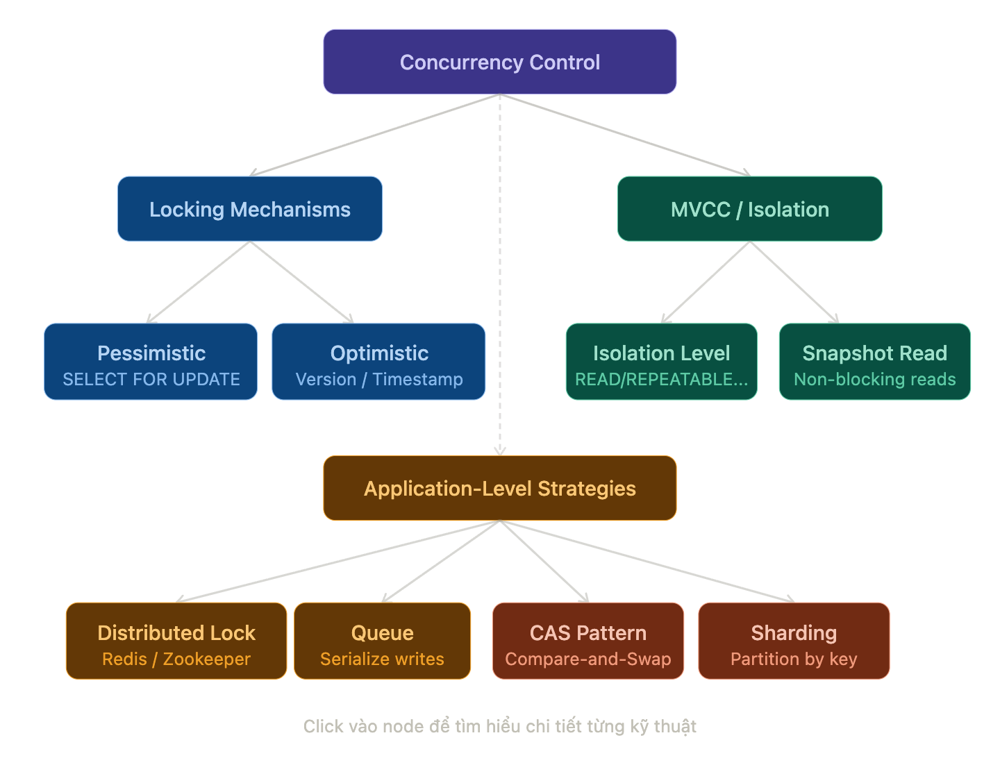

# Database Concurrency Mastery

## Learning Path: Middle Engineer → Staff Engineer

> **7 Lessons · ~30 hours · Hands-on Labs**
> Mỗi lesson có lý thuyết, code thực tế, và bài tập để bạn consolidate kiến thức trước khi chuyển tiếp.

---

## Progression Map

| #   | Lesson                                                                | Level       | Est. Time |
| --- | --------------------------------------------------------------------- | ----------- | --------- |
| L1  | [Concurrency Problems — Hiểu Đúng Bệnh Trước Khi Kê Thuốc](#lesson-1) | Foundation  | 3–4h      |
| L2  | [Locking Deep Dive — Pessimistic vs Optimistic](#lesson-2)            | Core Skills | 4–5h      |
| L3  | [MVCC & Isolation Levels — Cơ Chế Bên Trong](#lesson-3)               | Core Skills | 4–5h      |
| L4  | [Application-Level Patterns — Viết Code Concurrency-Safe](#lesson-4)  | Applied     | 4–5h      |
| L5  | [Distributed Locking — Redis, Zookeeper & Pitfalls](#lesson-5)        | Advanced    | 4–5h      |
| L6  | [Queue & Event Sourcing — Serialize By Design](#lesson-6)             | Advanced    | 4–5h      |
| L7  | [Staff-Level Mastery — Tradeoffs, Incidents & Design](#lesson-7)      | Staff       | 5–6h      |

---

## Skill Level Checkpoint

| Level                       | Dấu hiệu nhận biết                                                                                                               |
| --------------------------- | -------------------------------------------------------------------------------------------------------------------------------- |
| **Junior**                  | Biết dùng transaction. Biết `SELECT FOR UPDATE` tồn tại.                                                                         |
| **Middle** ← _bạn hiện tại_ | Hiểu isolation levels. Dùng được optimistic lock. Chưa debug được production concurrency incident.                               |
| **Senior**                  | Thiết kế concurrency strategy cho cả service. Chọn đúng tool cho từng use case.                                                  |
| **Staff** ← _mục tiêu_      | Review architecture của team khác. Phân tích tradeoff distributed vs local lock. Mentor team. Viết ADR về concurrency decisions. |

---

> **💡 Cách dùng document này**
>
> 1. Đọc theo thứ tự — mỗi lesson build on knowledge từ lesson trước
> 2. Làm Lab Exercise trước khi xem gợi ý — tự struggle là cách học tốt nhất
> 3. Áp dụng ngay vào project thực tế — kiến thức chỉ thực sự ngấm khi bạn gặp production issue
> 4. Revisit Lesson 7 sau mỗi concurrency incident trong team

---

---

# Lesson 1

## Concurrency Problems — Hiểu Đúng Bệnh Trước Khi Kê Thuốc

`Foundation` · `3–4 hours`

### Mục tiêu

- Định nghĩa chính xác 5 concurrency anomalies: Dirty Read, Non-Repeatable Read, Phantom Read, Lost Update, Write Skew
- Reproduce từng vấn đề bằng SQL thực tế (không phải lý thuyết thuần túy)
- Hiểu tại sao mỗi anomaly nguy hiểm trong context production cụ thể

---

### 1.1 Tại Sao Concurrency Là Vấn Đề?

Database chạy nhiều transaction song song để tối ưu throughput. Chính sự song song này tạo ra **race condition** — kết quả phụ thuộc vào thứ tự thực thi không thể đoán trước.

Hãy hình dung hệ thống đặt vé concert: 100 người cùng thấy "còn 1 vé", tất cả click mua. Không có concurrency control đúng → bán 100 vé từ 1 vé duy nhất.

---

### 1.2 Dirty Read

**Định nghĩa:** Transaction A đọc data mà transaction B đang ghi dở nhưng chưa commit. Nếu B rollback, A đã đọc data "ma" không bao giờ thực sự tồn tại.

**Ví dụ thực tế:** Hệ thống chuyển khoản. T1 đang trừ 500k từ account A (chưa commit). T2 đọc số dư thấy đã trừ rồi → ra quyết định sai. T1 fail và rollback → số dư thực ra chưa thay đổi.

```sql
-- Session 1: Bắt đầu chuyển khoản (CHƯA COMMIT)
BEGIN;
UPDATE accounts SET balance = balance - 500000 WHERE id = 1;
-- ... đang xử lý tiếp, chưa COMMIT

-- Session 2: Đọc số dư (với READ UNCOMMITTED)
SET TRANSACTION ISOLATION LEVEL READ UNCOMMITTED;
BEGIN;
SELECT balance FROM accounts WHERE id = 1;
-- ⚠️  Thấy balance đã bị trừ 500k dù T1 chưa commit!

-- Session 1: Rollback vì lỗi hệ thống
ROLLBACK;
-- Session 2 đã ra quyết định dựa trên data không bao giờ tồn tại
```

**Fix:** Dùng `READ COMMITTED` trở lên (default của hầu hết DB).

---

### 1.3 Non-Repeatable Read

**Định nghĩa:** Trong cùng một transaction, cùng một câu query trả về kết quả khác nhau ở hai lần gọi liên tiếp vì transaction khác đã commit thay đổi giữa hai lần đọc.

```sql
-- Session 1
BEGIN;
SELECT price FROM products WHERE id = 42;
-- Returns: 100,000

  -- Session 2 (commit xong giữa chừng):
  UPDATE products SET price = 150000 WHERE id = 42;
  COMMIT;

SELECT price FROM products WHERE id = 42;
-- Returns: 150,000 ← khác lần trước!
COMMIT;
```

**Nguy hiểm khi nào:** Bạn đọc giá để hiển thị, rồi đọc lại để tính tổng tiền — hai con số không khớp nhau.

**Fix:** Dùng `REPEATABLE READ` hoặc cao hơn.

---

### 1.4 Phantom Read

**Định nghĩa:** Transaction đọc tập rows theo điều kiện. Transaction khác insert/delete row thỏa điều kiện đó và commit. Lần đọc tiếp theo trong transaction đầu trả về số rows khác — rows "ma" xuất hiện hoặc biến mất.

```sql
-- Session 1
BEGIN;
SELECT COUNT(*) FROM orders WHERE user_id = 5 AND status = 'pending';
-- Returns: 3

  -- Session 2 (commit xong giữa chừng):
  INSERT INTO orders (user_id, status) VALUES (5, 'pending');
  COMMIT;

SELECT COUNT(*) FROM orders WHERE user_id = 5 AND status = 'pending';
-- Returns: 4 ← Phantom row xuất hiện!
COMMIT;
```

**Fix:** `SERIALIZABLE` hoặc dùng `SELECT ... FOR UPDATE` trên range. `REPEATABLE READ` trong PostgreSQL không fix Phantom Read cho range query.

---

### 1.5 Lost Update

**Định nghĩa:** Hai transaction cùng đọc một giá trị, tính toán dựa trên đó, rồi cùng ghi lại. Update của transaction đến trước bị ghi đè bởi transaction sau — mất hoàn toàn.

```sql
-- Cả 2 transaction cùng đọc stock = 10
T1: SELECT stock FROM products WHERE id = 1;  -- 10
T2: SELECT stock FROM products WHERE id = 1;  -- 10

-- T1 tính 10 - 3 = 7, ghi lại
T1: UPDATE products SET stock = 7 WHERE id = 1;
T1: COMMIT;

-- T2 tính 10 - 5 = 5, ghi lại (không biết T1 đã thay đổi!)
T2: UPDATE products SET stock = 5 WHERE id = 1;
T2: COMMIT;

-- Stock thực tế nên là: 10 - 3 - 5 = 2
-- Stock thực tế trong DB: 5  ← Lost Update!
```

**Fix:** Pessimistic Lock (`FOR UPDATE`) hoặc Optimistic Lock (version column). Xem chi tiết ở Lesson 2.

---

### 1.6 Write Skew

**Định nghĩa:** Dạng phức tạp nhất. Hai transaction đọc cùng một tập data, mỗi transaction thay đổi một phần _khác nhau_ của tập đó. Từng transaction riêng lẻ là valid, nhưng kết quả kết hợp vi phạm business constraint.

**Ví dụ kinh điển:** Bệnh viện yêu cầu luôn có ít nhất 1 bác sĩ trực.

```sql
-- Schema
CREATE TABLE on_call (doctor_id INT, is_on_call BOOLEAN);
-- Hiện tại: Alice = true, Bob = true

-- T1: Alice xin nghỉ
BEGIN;
SELECT COUNT(*) FROM on_call WHERE is_on_call = true;
-- Returns: 2 → OK, còn Bob trực
UPDATE on_call SET is_on_call = false WHERE doctor_id = 1; -- Alice
COMMIT;

-- T2: Bob xin nghỉ (chạy đồng thời với T1!)
BEGIN;
SELECT COUNT(*) FROM on_call WHERE is_on_call = true;
-- Returns: 2 → OK, còn Alice trực  (đọc trước khi T1 commit!)
UPDATE on_call SET is_on_call = false WHERE doctor_id = 2; -- Bob
COMMIT;

-- Kết quả: 0 bác sĩ trực ← Business constraint bị vi phạm!
```

**Fix:** Chỉ có 2 cách:

1. `SERIALIZABLE` isolation
2. `SELECT ... FOR UPDATE` trên **tất cả** rows liên quan đến constraint check

---

### 📊 Tổng Kết Anomalies

| Anomaly             | Isolation Fix     | Lock Fix                 | Mức độ nguy hiểm |
| ------------------- | ----------------- | ------------------------ | ---------------- |
| Dirty Read          | READ COMMITTED    | —                        | 🔴 Cao           |
| Non-Repeatable Read | REPEATABLE READ   | —                        | 🟠 Trung bình    |
| Lost Update         | REPEATABLE READ\* | FOR UPDATE / Optimistic  | 🔴 Cao           |
| Phantom Read        | SERIALIZABLE      | FOR UPDATE (range)       | 🟠 Trung bình    |
| Write Skew          | SERIALIZABLE      | FOR UPDATE (all related) | 🔴 Cao           |

> \*PostgreSQL REPEATABLE READ không tự động fix Lost Update — vẫn cần explicit lock.

---

### 🔬 Lab Exercise 1

**Setup:**

```bash
docker run --name pg-lab -e POSTGRES_PASSWORD=pass -p 5432:5432 -d postgres:15
psql -h localhost -U postgres
```

**Task 1 — Reproduce Lost Update:**
Tạo bảng `products(id, stock)`. Mở 2 psql sessions. Dùng `pg_sleep(3)` để control timing. Reproduce Lost Update với stock management.

**Task 2 — Reproduce Write Skew:**
Tạo bảng `on_call(doctor_id, is_on_call)`. Reproduce scenario bác sĩ trực. Confirm vi phạm constraint.

**Task 3 — Verify Fixes:**
Với mỗi scenario trên, áp dụng fix phù hợp và confirm anomaly không còn xảy ra.

**Gợi ý:** Dùng hai terminal chạy song song, đặt breakpoint bằng `SELECT pg_sleep(N)` giữa các câu lệnh.

---

---

# Lesson 2

## Locking Deep Dive — Pessimistic vs Optimistic

`Core Skills` · `4–5 hours`

### Mục tiêu

- Hiểu cơ chế hoạt động của Pessimistic Locking: shared lock, exclusive lock, lock granularity
- Implement Optimistic Locking với version column + retry logic đúng chuẩn production
- Nhận biết, debug và xử lý deadlock
- Biết khi nào chọn Pessimistic vs Optimistic cho từng use case cụ thể

---

### 2.1 Pessimistic Locking

Giả định conflict **sẽ** xảy ra — nên khóa tài nguyên trước khi làm việc. Phù hợp với hệ thống có **contention cao** (nhiều writer tranh cùng một row).

#### SELECT FOR UPDATE (Exclusive Lock)

```sql
BEGIN;

-- Đọc và khóa row ngay lập tức
-- Các transaction khác BLOCK tại dòng này cho đến khi COMMIT/ROLLBACK
SELECT id, stock
FROM products
WHERE id = 1
FOR UPDATE;

-- Bây giờ an toàn để update — không ai có thể chen vào
UPDATE products
SET stock = stock - 1
WHERE id = 1
  AND stock > 0;

COMMIT;  -- Lock được release tại đây
```

#### SELECT FOR SHARE (Shared Lock)

Dùng khi bạn cần đọc và ngăn UPDATE, nhưng vẫn cho phép transaction khác cùng đọc.

```sql
-- Nhiều transaction có thể cùng giữ SHARE lock
BEGIN;
SELECT * FROM accounts WHERE id = 1 FOR SHARE;

-- Transaction muốn FOR UPDATE sẽ phải chờ
-- cho đến khi tất cả SHARE lock release
```

#### SKIP LOCKED — Pattern Quan Trọng Cho Job Queue

```sql
-- Worker pattern: lấy job mà không block các worker khác
BEGIN;
SELECT id, payload
FROM job_queue
WHERE status = 'pending'
ORDER BY created_at
LIMIT 1
FOR UPDATE SKIP LOCKED;  -- Bỏ qua row đang bị lock bởi worker khác

UPDATE job_queue SET status = 'processing' WHERE id = :id;
COMMIT;
```

`SKIP LOCKED` là pattern chuẩn để implement distributed job queue bằng PostgreSQL — không cần Redis.

---

### 2.2 Optimistic Locking

Giả định conflict **hiếm khi** xảy ra — không khóa, nhưng detect và handle conflict tại commit time. Phù hợp với hệ thống **read-heavy**, nhiều reader ít writer.

#### Version Column Pattern

```sql
-- Schema: thêm cột version
ALTER TABLE products ADD COLUMN version INT NOT NULL DEFAULT 0;

-- Step 1: Đọc data kèm version
SELECT id, stock, version FROM products WHERE id = 1;
-- Returns: { id: 1, stock: 10, version: 5 }

-- Step 2: Update kèm version check
UPDATE products
SET
  stock   = stock - 1,
  version = version + 1      -- Tăng version
WHERE id      = 1
  AND version = 5;            -- Chỉ update nếu version chưa thay đổi

-- Kiểm tra rows affected:
-- 0 rows → Conflict! Người khác đã update trước → cần retry
-- 1 row  → Success
```

#### Retry Logic đúng chuẩn production

```javascript
async function updateStockWithRetry(productId, quantity, maxRetries = 3) {
  for (let attempt = 0; attempt < maxRetries; attempt++) {
    const { rows } = await db.query(
      "SELECT id, stock, version FROM products WHERE id = $1",
      [productId],
    );
    const product = rows[0];

    if (product.stock < quantity) {
      throw new Error("Insufficient stock");
    }

    const result = await db.query(
      `UPDATE products
       SET stock   = stock - $1,
           version = version + 1
       WHERE id      = $2
         AND version = $3`,
      [quantity, productId, product.version],
    );

    if (result.rowCount === 1) {
      return { success: true, attempt: attempt + 1 };
    }

    // Conflict — chờ một chút rồi retry (exponential backoff)
    const delay = Math.min(50 * Math.pow(2, attempt), 500);
    await new Promise((resolve) => setTimeout(resolve, delay));
  }

  throw new Error(`Failed after ${maxRetries} attempts — high contention`);
}
```

> **Lưu ý production:** Sau `maxRetries` lần fail, đừng throw generic error. Log metric `optimistic_lock_retry_exhausted` để monitor contention. Nếu metric này cao → cân nhắc chuyển sang Pessimistic Lock.

---

### 2.3 Deadlock — Nguyên Nhân và Xử Lý

Deadlock xảy ra khi 2 transaction chờ nhau theo vòng tròn.

```
T1 giữ lock trên Row A, đợi lock Row B
T2 giữ lock trên Row B, đợi lock Row A
→ Không ai tiến được → Deadlock
```

#### Reproduce Deadlock

```sql
-- Session 1
BEGIN;
UPDATE accounts SET balance = balance - 100 WHERE id = 1;  -- Lock row 1
-- (chưa commit, tiếp tục...)

-- Session 2
BEGIN;
UPDATE accounts SET balance = balance - 200 WHERE id = 2;  -- Lock row 2
UPDATE accounts SET balance = balance + 200 WHERE id = 1;  -- BLOCK chờ Session 1

-- Session 1 tiếp tục
UPDATE accounts SET balance = balance + 100 WHERE id = 2;  -- BLOCK chờ Session 2
-- → DEADLOCK! Database detect và rollback một trong hai
```

#### 3 Cách Phòng Tránh Deadlock

**Cách 1: Lock theo thứ tự nhất quán**

```sql
-- LUÔN lock account có id nhỏ hơn trước
-- Không bao giờ lock ngược thứ tự
BEGIN;
SELECT * FROM accounts WHERE id IN (1, 2) ORDER BY id FOR UPDATE;
-- Luôn lock id=1 trước, id=2 sau → không bao giờ deadlock
```

**Cách 2: Lock tất cả cùng một lúc**

```sql
BEGIN;
SELECT * FROM accounts
WHERE id = ANY(ARRAY[1, 2])
FOR UPDATE;
-- Lấy tất cả locks trong một query
```

**Cách 3: Lock timeout**

```sql
-- Postgres: set lock timeout để không block mãi mãi
SET lock_timeout = '5s';
BEGIN;
SELECT * FROM products WHERE id = 1 FOR UPDATE;
-- Sau 5s không lấy được lock → raise error thay vì đợi mãi
```

#### Detect Deadlock trong Application

```javascript
async function transferWithDeadlockRetry(fromId, toId, amount) {
  const MAX_RETRIES = 3;

  for (let i = 0; i < MAX_RETRIES; i++) {
    try {
      await db.transaction(async (trx) => {
        // Lock theo thứ tự id tăng dần để tránh deadlock
        const [first, second] = fromId < toId ? [fromId, toId] : [toId, fromId];

        await trx.raw("SELECT id FROM accounts WHERE id = ANY(?) FOR UPDATE", [
          [first, second],
        ]);

        await trx("accounts").where("id", fromId).decrement("balance", amount);
        await trx("accounts").where("id", toId).increment("balance", amount);
      });
      return; // Success
    } catch (err) {
      // PostgreSQL deadlock error code: 40P01
      if (err.code === "40P01" && i < MAX_RETRIES - 1) {
        await sleep(Math.random() * 100); // Random delay tránh livelock
        continue;
      }
      throw err;
    }
  }
}
```

---

### 2.4 Pessimistic vs Optimistic — Khi Nào Dùng Gì?

| Tiêu chí             | Pessimistic                 | Optimistic                |
| -------------------- | --------------------------- | ------------------------- |
| **Write contention** | Cao (nhiều writer)          | Thấp (ít conflict)        |
| **Latency**          | Cao hơn (blocking)          | Thấp hơn (non-blocking)   |
| **Throughput**       | Thấp hơn                    | Cao hơn                   |
| **Retry complexity** | Không cần retry             | Cần retry logic           |
| **Deadlock risk**    | Có                          | Không                     |
| **Use case**         | Booking, inventory, banking | CMS, user profile, config |

**Rule of thumb:**

- Nếu P(conflict) > 20% → Pessimistic
- Nếu P(conflict) < 5% → Optimistic
- Nếu conflict là catastrophic (tài chính, sức khỏe) → Pessimistic dù conflict thấp

---

### 🔬 Lab Exercise 2

**Task 1 — Flash Sale Inventory:**
Simulate 100 concurrent requests trừ stock cùng lúc. Implement bằng Pessimistic Lock. Verify không có stock đi dưới 0.

```bash
# Dùng pgbench hoặc script Node.js với Promise.all
node simulate-concurrent-purchases.js --users=100 --product-id=1
```

**Task 2 — Version Conflict:**
Implement Optimistic Lock cho product update. Manually trigger conflict bằng 2 sessions. Verify retry logic hoạt động đúng.

**Task 3 — Deadlock Detection:**
Tạo scenario deadlock như ví dụ trên. Verify database tự detect và rollback một transaction. Implement proper retry handling trong application code.

---

---

# Lesson 3

## MVCC & Isolation Levels — Cơ Chế Bên Trong

`Core Skills` · `4–5 hours`

### Mục tiêu

- Hiểu MVCC hoạt động như thế nào bên trong PostgreSQL
- Biết chính xác isolation level nào fix được anomaly nào
- Biết performance trade-off khi tăng isolation level
- Cấu hình đúng cho từng use case trong production

---

### 3.1 MVCC — Multi-Version Concurrency Control

MVCC là nền tảng của PostgreSQL (và hầu hết modern database). Ý tưởng cốt lõi: **thay vì lock data khi đọc, database giữ nhiều phiên bản của cùng một row**.

#### Cơ Chế Hoạt Động

Mỗi row trong PostgreSQL có hidden columns:

- `xmin`: transaction ID đã tạo ra row này
- `xmax`: transaction ID đã xóa/update row này (0 nếu còn sống)

```sql
-- Xem hidden columns (internal, chỉ dùng để học)
SELECT xmin, xmax, id, stock FROM products WHERE id = 1;
-- xmin=100, xmax=0 → Row được tạo bởi txn 100, còn sống
```

Khi bạn UPDATE:

1. Row cũ không bị xóa ngay — `xmax` được set bằng txn ID hiện tại
2. Row mới được INSERT với `xmin` = txn ID hiện tại
3. Concurrent readers vẫn thấy row cũ cho đến khi transaction của họ bắt đầu sau txn update commit

```
Timeline:
Txn 100: INSERT row (xmin=100, xmax=0)     → stock=10
Txn 101: UPDATE row                         → stock=9
         Row cũ: (xmin=100, xmax=101)      [marked deleted]
         Row mới: (xmin=101, xmax=0)       stock=9

Txn 99 (đang chạy, bắt đầu trước txn 101):
  → Chỉ thấy row có xmin ≤ 99 và xmax=0 hoặc xmax > 99
  → Vẫn đọc được stock=10 từ row cũ (xmax=101 > 99)
```

Đây là lý do **readers không block writers và writers không block readers** trong PostgreSQL.

---

### 3.2 Isolation Levels Chi Tiết

#### READ COMMITTED (Default PostgreSQL)

Mỗi câu query thấy snapshot tại thời điểm **câu query đó bắt đầu** (không phải transaction bắt đầu).

```sql
-- Session 1
BEGIN;
SELECT balance FROM accounts WHERE id = 1;  -- 1000

  -- Session 2 commit xong:
  UPDATE accounts SET balance = 800 WHERE id = 1;
  COMMIT;

SELECT balance FROM accounts WHERE id = 1;  -- 800 ← thấy committed change!
COMMIT;
-- Non-Repeatable Read xảy ra
```

**Dùng khi:** Phù hợp với phần lớn read operations. Default tốt cho hầu hết web apps.

#### REPEATABLE READ

Transaction thấy snapshot tại thời điểm **transaction bắt đầu** — không đổi trong suốt transaction.

```sql
SET TRANSACTION ISOLATION LEVEL REPEATABLE READ;
BEGIN;
SELECT balance FROM accounts WHERE id = 1;  -- 1000

  -- Session 2 commit:
  UPDATE accounts SET balance = 800 WHERE id = 1;
  COMMIT;

SELECT balance FROM accounts WHERE id = 1;  -- 1000 ← vẫn thấy snapshot cũ
COMMIT;
-- Non-Repeatable Read KHÔNG xảy ra
```

**PostgreSQL REPEATABLE READ** cũng tự động detect và prevent Lost Update — nếu 2 transaction cùng update một row, cái sau sẽ bị abort với error `ERROR: could not serialize access due to concurrent update`.

#### SERIALIZABLE

Isolation level cao nhất. Transactions thực thi như thể chạy tuần tự, dù thực tế chạy song song.

```sql
SET TRANSACTION ISOLATION LEVEL SERIALIZABLE;
BEGIN;
SELECT COUNT(*) FROM on_call WHERE is_on_call = true;  -- 2

  -- Session 2 cùng SERIALIZABLE:
  -- Xin nghỉ thành công
  COMMIT;

-- Session 1 cố commit:
UPDATE on_call SET is_on_call = false WHERE doctor_id = 1;
COMMIT;
-- ERROR: could not serialize access due to concurrent update
-- → Write Skew được ngăn chặn!
```

**PostgreSQL dùng SSI** (Serializable Snapshot Isolation) — track read/write dependencies giữa transactions và abort khi phát hiện vòng tròn phụ thuộc.

---

### 3.3 Isolation Level vs Anomaly Matrix

| Isolation Level  | Dirty Read | Non-Repeatable | Lost Update | Phantom Read  | Write Skew |
| ---------------- | ---------- | -------------- | ----------- | ------------- | ---------- |
| READ UNCOMMITTED | ✅ Xảy ra  | ✅ Xảy ra      | ✅ Xảy ra   | ✅ Xảy ra     | ✅ Xảy ra  |
| READ COMMITTED   | ❌ Fixed   | ✅ Xảy ra      | ✅ Xảy ra   | ✅ Xảy ra     | ✅ Xảy ra  |
| REPEATABLE READ  | ❌ Fixed   | ❌ Fixed       | ❌ Fixed\*  | ✅ Xảy ra\*\* | ✅ Xảy ra  |
| SERIALIZABLE     | ❌ Fixed   | ❌ Fixed       | ❌ Fixed    | ❌ Fixed      | ❌ Fixed   |

> \*PostgreSQL REPEATABLE READ fix Lost Update; MySQL thì không.
> \*\*PostgreSQL REPEATABLE READ fix Phantom Read cho single-row, nhưng không fix hoàn toàn cho range queries.

---

### 3.4 Performance Trade-offs

```sql
-- Đo overhead của isolation levels (pgbench)
-- Chạy simple update benchmark

-- READ COMMITTED (default):
-- Throughput: ~10,000 TPS

-- REPEATABLE READ:
-- Overhead: ~5-10% do snapshot management
-- Abort rate: thấp với low contention

-- SERIALIZABLE:
-- Overhead: ~10-20% do SSI tracking
-- Abort rate: có thể cao với high contention (cần retry logic)
```

**Chiến lược production:**

```sql
-- Đặt default cho connection pool
SET default_transaction_isolation = 'read committed';

-- Override cho transaction cụ thể cần stronger guarantee
BEGIN ISOLATION LEVEL REPEATABLE READ;
-- ... financial report transaction
COMMIT;

-- Chỉ dùng SERIALIZABLE khi thực sự cần (Write Skew protection)
BEGIN ISOLATION LEVEL SERIALIZABLE;
-- ... on-call scheduling
COMMIT;
```

---

### 3.5 Vacuum và MVCC Overhead

MVCC tạo ra dead rows (row cũ sau khi update). PostgreSQL có **AUTOVACUUM** để dọn dẹp.

```sql
-- Kiểm tra bloat do MVCC
SELECT schemaname, tablename,
       n_dead_tup,
       n_live_tup,
       round(n_dead_tup::numeric / NULLIF(n_live_tup + n_dead_tup, 0) * 100, 2) AS dead_pct
FROM pg_stat_user_tables
WHERE n_dead_tup > 1000
ORDER BY n_dead_tup DESC;

-- Nếu dead_pct > 20% → cần tune autovacuum
-- Tables với heavy UPDATE workload cần aggressive vacuum settings

ALTER TABLE orders SET (
  autovacuum_vacuum_scale_factor = 0.01,  -- vacuum khi 1% rows là dead (default 20%)
  autovacuum_analyze_scale_factor = 0.005
);
```

---

### 🔬 Lab Exercise 3

**Task 1 — Observe MVCC:**
Dùng `xmin`/`xmax` hidden columns để observe MVCC in action. Chạy UPDATE, kiểm tra cả old và new version còn trong table.

**Task 2 — Isolation Level Comparison:**
Viết script reproduce Non-Repeatable Read với READ COMMITTED. Verify REPEATABLE READ fix nó. Verify REPEATABLE READ không fix Write Skew.

**Task 3 — SERIALIZABLE Abort Handling:**
Implement Write Skew scenario với SERIALIZABLE. Handle `could not serialize` error bằng retry logic. Measure abort rate dưới load.

---

---

# Lesson 4

## Application-Level Patterns — Viết Code Concurrency-Safe

`Applied` · `4–5 hours`

### Mục tiêu

- Implement các patterns concurrency-safe ở application layer
- Hiểu Idempotency Key pattern — critical cho distributed systems
- Master Compare-and-Swap (CAS) pattern
- Biết cách audit và test concurrency correctness

---

### 4.1 Idempotency Key Pattern

**Vấn đề:** Client gửi request, timeout, retry — server có thể xử lý 2 lần → duplicate charge, double booking.

**Giải pháp:** Client generate unique key, gửi kèm request. Server store key + result. Request thứ 2 với cùng key → return cached result, không xử lý lại.

```sql
-- Schema
CREATE TABLE idempotency_keys (
  key         UUID PRIMARY KEY,
  request_hash VARCHAR(64),    -- Hash của request body để detect thay đổi
  response    JSONB,
  status      VARCHAR(20),     -- 'processing' | 'completed' | 'failed'
  created_at  TIMESTAMPTZ DEFAULT NOW(),
  expires_at  TIMESTAMPTZ DEFAULT NOW() + INTERVAL '24 hours'
);

CREATE INDEX ON idempotency_keys (expires_at);
```

```javascript
async function processPaymentIdempotent(idempotencyKey, paymentData) {
  const requestHash = crypto
    .createHash("sha256")
    .update(JSON.stringify(paymentData))
    .digest("hex");

  return await db.transaction(async (trx) => {
    // Upsert với conflict detection
    const result = await trx.raw(
      `
      INSERT INTO idempotency_keys (key, request_hash, status)
      VALUES (?, ?, 'processing')
      ON CONFLICT (key) DO UPDATE
        SET key = EXCLUDED.key  -- no-op update để trigger RETURNING
      RETURNING *
    `,
      [idempotencyKey, requestHash],
    );

    const record = result.rows[0];

    // Key đã tồn tại
    if (record.request_hash !== requestHash) {
      throw new Error("Idempotency key reused with different request");
    }

    if (record.status === "completed") {
      return record.response; // Return cached result
    }

    if (record.status === "processing") {
      throw new Error("Request is still being processed. Retry after 5s.");
    }

    // Xử lý payment thực sự
    const paymentResult = await chargeCard(paymentData);

    // Update với kết quả
    await trx("idempotency_keys")
      .where("key", idempotencyKey)
      .update({
        status: "completed",
        response: JSON.stringify(paymentResult),
      });

    return paymentResult;
  });
}
```

---

### 4.2 Compare-and-Swap (CAS) Pattern

CAS là atomic operation: "chỉ update nếu value hiện tại bằng expected value." Không cần lock, không cần transaction phức tạp.

```sql
-- CAS cho counter
UPDATE rate_limits
SET
  request_count = request_count + 1,
  window_reset  = CASE
    WHEN window_reset < NOW() THEN NOW() + INTERVAL '1 minute'
    ELSE window_reset
  END
WHERE user_id = :userId
  AND (request_count < :maxRequests OR window_reset < NOW())
RETURNING request_count, window_reset;

-- 0 rows returned → rate limit exceeded
-- 1 row returned → request allowed
```

```javascript
// CAS cho state machine transition
async function transitionOrderStatus(orderId, expectedStatus, newStatus) {
  const result = await db.query(
    `UPDATE orders
     SET status     = $1,
         updated_at = NOW()
     WHERE id     = $2
       AND status = $3  -- CAS: chỉ update nếu status đúng
     RETURNING id, status`,
    [newStatus, orderId, expectedStatus],
  );

  if (result.rowCount === 0) {
    const current = await db.query("SELECT status FROM orders WHERE id = $1", [
      orderId,
    ]);
    throw new Error(
      `Cannot transition from ${current.rows[0]?.status} to ${newStatus}. ` +
        `Expected status: ${expectedStatus}`,
    );
  }

  return result.rows[0];
}

// Usage — safe state machine
await transitionOrderStatus(orderId, "pending", "confirmed");
await transitionOrderStatus(orderId, "confirmed", "shipped");
await transitionOrderStatus(orderId, "shipped", "delivered");
// Không thể skip state hoặc transition sai thứ tự
```

---

### 4.3 Atomic Increment Pattern

```sql
-- WRONG: Read-modify-write (Lost Update)
SELECT views FROM posts WHERE id = 1;      -- 100
UPDATE posts SET views = 101 WHERE id = 1; -- Có thể mất update của others

-- CORRECT: Atomic increment
UPDATE posts
SET views = views + 1
WHERE id = 1
RETURNING views;
-- Database thực hiện read-modify-write atomically trong một operation
```

```sql
-- Conditional atomic update — trừ tồn kho không đi âm
UPDATE products
SET stock = stock - :quantity
WHERE id    = :productId
  AND stock >= :quantity  -- Điều kiện ngăn âm
RETURNING stock;

-- 0 rows → không đủ hàng
-- 1 row  → success, trả về stock mới
```

---

### 4.4 Upsert — Insert or Update Atomically

```sql
-- WRONG: Check-then-act (race condition)
SELECT id FROM user_stats WHERE user_id = 1;
IF not found:
  INSERT INTO user_stats ...
ELSE:
  UPDATE user_stats ...

-- CORRECT: Atomic upsert
INSERT INTO user_stats (user_id, login_count, last_login)
VALUES (:userId, 1, NOW())
ON CONFLICT (user_id) DO UPDATE
SET
  login_count = user_stats.login_count + 1,
  last_login  = EXCLUDED.last_login;
-- Atomic — không có race condition
```

---

### 4.5 Testing Concurrency Correctness

```javascript
// Test: Verify không có Lost Update dưới concurrency
describe("Stock management", () => {
  it("should not allow stock to go negative under concurrency", async () => {
    // Setup: 10 units
    await db.query("UPDATE products SET stock = 10 WHERE id = 1");

    // Simulate 20 concurrent purchases of 1 unit each
    const results = await Promise.allSettled(
      Array.from({ length: 20 }, () =>
        purchaseProduct((productId = 1), (quantity = 1)),
      ),
    );

    const succeeded = results.filter((r) => r.status === "fulfilled").length;
    const failed = results.filter((r) => r.status === "rejected").length;

    // Verify: chỉ 10 purchases thành công
    expect(succeeded).toBe(10);
    expect(failed).toBe(10);

    // Verify: stock chính xác bằng 0
    const { rows } = await db.query("SELECT stock FROM products WHERE id = 1");
    expect(rows[0].stock).toBe(0);
  });
});
```

---

### 🔬 Lab Exercise 4

**Task 1 — Idempotent Payment API:**
Build Express endpoint `/payments` nhận `X-Idempotency-Key` header. Simulate delayed processing với `pg_sleep`. Test retry behavior với `curl`.

**Task 2 — Order State Machine:**
Implement `transitionOrderStatus` với CAS. Viết test verify invalid transitions đều bị reject. Test concurrent transitions cùng order.

**Task 3 — Concurrency Test Suite:**
Viết Jest tests cho tất cả các patterns trên. Mục tiêu: test chạy 50 concurrent operations, verify invariants luôn được giữ.

---

---

# Lesson 5

## Distributed Locking — Redis, Zookeeper & Pitfalls

`Advanced` · `4–5 hours`

### Mục tiêu

- Hiểu khi nào cần distributed lock thay vì DB lock
- Implement Redis-based lock đúng cách (không phải naive SET)
- Hiểu Redlock algorithm và controversies xung quanh nó
- Biết failure scenarios và cách handle

---

### 5.1 Khi Nào Cần Distributed Lock?

DB-level lock chỉ work trong một database. Distributed lock cần khi:

- **Multiple service instances** tranh cùng một tài nguyên
- **Cross-service coordination** (Service A và Service B không share DB)
- **Rate limiting** across instances
- **Leader election** cho scheduled jobs

---

### 5.2 Naive Redis Lock — Những Gì Sai

```javascript
// ❌ WRONG — nhiều vấn đề nghiêm trọng
async function naiveLock(key) {
  const existing = await redis.get(key);
  if (existing) return false; // Problem 1: Race condition giữa GET và SET
  await redis.set(key, "1");
  await redis.expire(key, 30); // Problem 2: SET và EXPIRE không atomic
  return true; // Problem 3: Không có owner tracking
}
```

**Vấn đề:**

1. Race condition: 2 instances cùng check `GET` thấy null, cùng `SET` → cả hai nghĩ mình có lock
2. Không atomic: crash giữa `SET` và `EXPIRE` → lock không bao giờ expire → deadlock mãi mãi
3. Không có owner: bất kỳ ai cũng có thể release lock của người khác

---

### 5.3 Correct Redis Lock Implementation

```javascript
const crypto = require("crypto");

class RedisLock {
  constructor(redis, options = {}) {
    this.redis = redis;
    this.ttl = options.ttl || 30000; // 30s default
    this.retries = options.retries || 3;
    this.delay = options.retryDelay || 200;
  }

  async acquire(resource) {
    const token = crypto.randomUUID(); // Unique owner token

    for (let i = 0; i <= this.retries; i++) {
      // SET NX PX = atomic set-if-not-exists với millisecond expiry
      const result = await this.redis.set(
        `lock:${resource}`,
        token,
        "NX", // Only set if Not eXists
        "PX", // Expiry in milliseconds
        this.ttl,
      );

      if (result === "OK") {
        return { token, resource };
      }

      if (i < this.retries) {
        await sleep(this.delay + Math.random() * 100); // Jitter
      }
    }

    throw new Error(`Could not acquire lock for: ${resource}`);
  }

  async release(lock) {
    // Lua script để atomic check-and-delete
    // Chỉ xóa nếu token khớp — không xóa lock của người khác
    const script = `
      if redis.call("get", KEYS[1]) == ARGV[1] then
        return redis.call("del", KEYS[1])
      else
        return 0
      end
    `;

    const result = await this.redis.eval(
      script,
      1,
      `lock:${lock.resource}`,
      lock.token,
    );

    if (result === 0) {
      // Lock đã expire và bị acquire bởi instance khác
      // Log warning — business logic có thể đã bị overlapping execution
      console.warn(`Lock for ${lock.resource} was already released or expired`);
    }
  }

  async withLock(resource, fn) {
    const lock = await this.acquire(resource);
    try {
      return await fn();
    } finally {
      await this.release(lock);
    }
  }
}

// Usage
const lock = new RedisLock(redisClient, { ttl: 10000, retries: 3 });

await lock.withLock(`user:${userId}:credit`, async () => {
  // Code này chỉ chạy trên một instance tại một thời điểm
  const user = await db.query("SELECT credits FROM users WHERE id = $1", [
    userId,
  ]);
  if (user.credits < amount) throw new Error("Insufficient credits");
  await db.query("UPDATE users SET credits = credits - $1 WHERE id = $2", [
    amount,
    userId,
  ]);
});
```

---

### 5.4 Lock Expiry — The Fundamental Problem

**Scenario nguy hiểm:**

```
Instance A: Acquire lock (TTL=30s)
Instance A: Bắt đầu xử lý...
Instance A: GC pause 35 giây  ← Common trong JVM, Node.js ít hơn nhưng vẫn có
Instance A: Lock đã expire!

Instance B: Acquire lock (lock đã expire)
Instance B: Bắt đầu xử lý...

Instance A: GC resume, tiếp tục xử lý... ← Hai instances cùng trong critical section!
```

**Giải pháp 1: Fencing Token**

```javascript
// Redis trả về monotonically increasing token
const { token, fencingToken } = await lock.acquire(resource);

// Truyền fencing token vào mọi downstream operation
await database.update(data, { ifFencingTokenAtLeast: fencingToken });
// DB reject nếu fencing token nhỏ hơn cái đã seen → A bị reject
```

**Giải pháp 2: Lease Renewal**

```javascript
async function acquireWithRenewal(resource, fn) {
  const lock = await redisLock.acquire(resource);

  // Renew lock mỗi TTL/3 giây
  const renewInterval = setInterval(async () => {
    await redis.pexpire(`lock:${resource}`, this.ttl);
  }, this.ttl / 3);

  try {
    return await fn();
  } finally {
    clearInterval(renewInterval);
    await redisLock.release(lock);
  }
}
```

---

### 5.5 Redlock — Khi Single Redis Node Không Đủ

Single Redis node có Single Point of Failure. Nếu Redis die → lock mất → multiple instances chạy.

Redlock dùng N Redis nodes (thường 5), acquire lock trên majority (≥ 3/5).

```javascript
const Redlock = require("redlock");

const redlock = new Redlock([redis1, redis2, redis3, redis4, redis5], {
  driftFactor: 0.01, // Clock drift allowance
  retryCount: 10,
  retryDelay: 200,
  retryJitter: 200,
});

await redlock.using(["resource"], 5000, async (signal) => {
  // signal.aborted = true nếu lock bị mất giữa chừng
  if (signal.aborted) throw signal.error;

  // Critical section
  await processJob();
});
```

**Controversy:** Martin Kleppmann (author của DDIA) argue rằng Redlock không đủ safe trong distributed systems với clock drift. Antirez (Redis creator) disagree. Trong thực tế: Redlock đủ tốt cho phần lớn use cases nếu bạn hiểu limitations của nó.

---

### 🔬 Lab Exercise 5

**Task 1 — Race Condition Demo:**
Implement naive lock, chạy 10 concurrent instances, observe race condition. Implement correct lock, verify fixed.

**Task 2 — Lock Expiry Simulation:**
Simulate GC pause bằng `setTimeout`. Observe hai instances cùng trong critical section. Implement fencing token để prevent issue.

**Task 3 — Distributed Rate Limiter:**
Build rate limiter dùng Redis lock + atomic increment: max 100 requests/minute per user across all service instances.

---

---

# Lesson 6

## Queue & Event Sourcing — Serialize By Design

`Advanced` · `4–5 hours`

### Mục tiêu

- Hiểu queue-based serialization giải quyết concurrency như thế nào
- Implement reliable job processing với PostgreSQL (không cần Redis)
- Nắm Kafka ordering guarantees và partition key strategy
- Hiểu Event Sourcing basics và connection với concurrency

---

### 6.1 Queue-Based Serialization

Thay vì để nhiều instances tranh nhau update DB, dồn tất cả writes vào một queue, xử lý tuần tự.

```
❌ Trước: 100 instances → DB (lock contention, deadlock)
✅ Sau:   100 instances → Queue → 1 consumer → DB (no contention)
```

Phù hợp khi: writes có thể delay một chút (async), thứ tự quan trọng, cần audit trail.

---

### 6.2 PostgreSQL Như Một Job Queue (SKIP LOCKED)

Không nhất thiết phải dùng Redis/Kafka cho mọi queue. PostgreSQL với `SKIP LOCKED` là giải pháp reliable, ít moving parts.

```sql
-- Schema
CREATE TABLE job_queue (
  id         BIGSERIAL PRIMARY KEY,
  type       VARCHAR(50),
  payload    JSONB,
  status     VARCHAR(20) DEFAULT 'pending',
  attempts   INT         DEFAULT 0,
  max_attempts INT       DEFAULT 3,
  scheduled_at TIMESTAMPTZ DEFAULT NOW(),
  locked_until TIMESTAMPTZ,
  created_at TIMESTAMPTZ DEFAULT NOW()
);

CREATE INDEX ON job_queue (status, scheduled_at)
  WHERE status = 'pending';
```

```javascript
class PgJobQueue {
  async dequeue(jobType, workerId) {
    return await db.transaction(async (trx) => {
      const result = await trx.raw(
        `
        UPDATE job_queue
        SET
          status       = 'processing',
          locked_until = NOW() + INTERVAL '5 minutes',
          attempts     = attempts + 1
        WHERE id = (
          SELECT id FROM job_queue
          WHERE status      = 'pending'
            AND type        = ?
            AND scheduled_at <= NOW()
            AND attempts    < max_attempts
          ORDER BY scheduled_at
          LIMIT 1
          FOR UPDATE SKIP LOCKED  -- Magic!
        )
        RETURNING *
      `,
        [jobType],
      );

      return result.rows[0] || null;
    });
  }

  async complete(jobId) {
    await db.query("UPDATE job_queue SET status = 'completed' WHERE id = $1", [
      jobId,
    ]);
  }

  async fail(jobId, error) {
    await db.query(
      `
      UPDATE job_queue
      SET status = CASE
            WHEN attempts >= max_attempts THEN 'failed'
            ELSE 'pending'  -- Retry
          END,
          last_error = $1
      WHERE id = $2
    `,
      [error.message, jobId],
    );
  }
}
```

---

### 6.3 Kafka Ordering Guarantees

Kafka đảm bảo ordering **trong một partition**. Cùng partition key → cùng partition → thứ tự đảm bảo.

```javascript
// Producer: Đảm bảo cùng user → cùng partition
await producer.send({
  topic: "user-events",
  messages: [
    {
      key: userId.toString(), // Partition key!
      value: JSON.stringify(event),
    },
  ],
});

// Consumer: Mỗi partition được xử lý bởi một consumer instance
// → Cùng user's events được xử lý theo đúng thứ tự
const consumer = kafka.consumer({ groupId: "payment-processor" });

await consumer.run({
  eachMessage: async ({ topic, partition, message }) => {
    const event = JSON.parse(message.value.toString());

    // Idempotency check — Kafka có thể deliver at-least-once
    const alreadyProcessed = await db.query(
      "SELECT 1 FROM processed_events WHERE event_id = $1",
      [event.id],
    );
    if (alreadyProcessed.rows.length > 0) return;

    await processEvent(event);

    // Mark as processed
    await db.query("INSERT INTO processed_events (event_id) VALUES ($1)", [
      event.id,
    ]);
  },
});
```

**Partition Key Strategy:**

| Use Case         | Partition Key | Lý do                                  |
| ---------------- | ------------- | -------------------------------------- |
| User activity    | `userId`      | Events của cùng user ordered           |
| Order processing | `orderId`     | Order state machine ordered            |
| Inventory        | `productId`   | Stock updates cho cùng product ordered |
| Payments         | `accountId`   | Balance changes ordered                |

---

### 6.4 Event Sourcing Basics

Thay vì store state hiện tại, store **sequence of events**. State = fold over events.

```sql
-- Event store
CREATE TABLE account_events (
  id          BIGSERIAL PRIMARY KEY,
  account_id  UUID NOT NULL,
  type        VARCHAR(50),          -- 'deposited', 'withdrawn', 'transferred'
  amount      DECIMAL(15, 2),
  metadata    JSONB,
  version     INT NOT NULL,         -- Optimistic lock cho aggregate
  occurred_at TIMESTAMPTZ DEFAULT NOW()
);

-- Unique constraint: (account_id, version) đảm bảo no concurrent writes
CREATE UNIQUE INDEX ON account_events (account_id, version);
```

```javascript
class AccountAggregate {
  constructor(accountId) {
    this.accountId = accountId;
    this.balance = 0;
    this.version = 0;
  }

  // Rebuild state từ events
  static async load(accountId) {
    const events = await db.query(
      "SELECT * FROM account_events WHERE account_id = $1 ORDER BY version",
      [accountId],
    );

    const account = new AccountAggregate(accountId);
    for (const event of events.rows) {
      account.apply(event);
    }
    return account;
  }

  apply(event) {
    this.version = event.version;
    if (event.type === "deposited") this.balance += event.amount;
    if (event.type === "withdrawn") this.balance -= event.amount;
  }

  async withdraw(amount) {
    if (this.balance < amount) throw new Error("Insufficient funds");

    // Optimistic lock: INSERT với version+1 sẽ fail nếu concurrent write
    await db.query(
      `INSERT INTO account_events (account_id, type, amount, version)
       VALUES ($1, 'withdrawn', $2, $3)`,
      [this.accountId, amount, this.version + 1],
      // UNIQUE constraint (account_id, version) đảm bảo atomicity
    );

    this.balance -= amount;
    this.version++;
  }
}
```

**Concurrency trong Event Sourcing:** Unique constraint `(aggregate_id, version)` làm Optimistic Lock tự nhiên — không cần explicit lock logic.

---

### 🔬 Lab Exercise 6

**Task 1 — PG Job Queue:**
Implement job queue với PostgreSQL. Chạy 5 worker processes song song. Verify mỗi job chỉ được xử lý đúng 1 lần. Test dead letter queue cho failed jobs.

**Task 2 — Kafka Ordering:**
Setup Kafka local với Docker. Produce 100 events cho 10 users (random order). Verify events của mỗi user được consume đúng thứ tự. Implement idempotency check.

**Task 3 — Event Sourcing:**
Implement `AccountAggregate`. Test concurrent withdrawals vượt quá balance. Verify Optimistic Lock prevent double-spend.

---

---

# Lesson 7

## Staff-Level Mastery — Tradeoffs, Incidents & Design

`Staff` · `5–6 hours`

### Mục tiêu

- Phân tích tradeoffs để chọn concurrency strategy cho hệ thống phức tạp
- Debug production concurrency incidents từ logs và metrics
- Viết Architecture Decision Record (ADR) về concurrency decisions
- Mentor junior/mid engineers về concurrency

---

### 7.1 Decision Framework

Khi đối mặt với concurrency problem trong hệ thống mới, đặt những câu hỏi này:

```
1. Scope: Concurrency trong một DB instance hay across instances?
   → Trong một DB: DB-level locking/isolation đủ
   → Cross-instance: Cần distributed lock hoặc queue

2. Contention: Mức độ tranh chấp tài nguyên thế nào?
   → Thấp (< 5% conflict): Optimistic Lock
   → Cao (> 20% conflict): Pessimistic Lock
   → Rất cao (sequential required): Queue

3. Consistency requirement: Bao nhiêu consistency là đủ?
   → Financial/medical: Strong consistency (SERIALIZABLE hoặc 2PL)
   → Social/analytics: Eventual consistency acceptable

4. Failure mode: Điều gì tệ nhất có thể xảy ra?
   → Data corruption (double charge, negative balance): Strong lock
   → Stale read (hiển thị số cũ): Weak isolation OK

5. Scale: Có thể scale single node không?
   → Có: Giữ đơn giản, DB-level lock
   → Không: Distributed solution, sharding by key
```

---

### 7.2 Concurrency Strategy cho Các Domain Phổ Biến

#### E-commerce Inventory

```sql
-- Strategy: Pessimistic Lock cho checkout, Optimistic cho catalog

-- Checkout flow (high contention, catastrophic if negative stock)
BEGIN;
SELECT id, stock FROM products WHERE id = :id FOR UPDATE;
-- ... validate and update stock
COMMIT;

-- Product view/search (low contention, stale read OK)
SELECT id, name, stock FROM products WHERE id = :id;
-- READ COMMITTED default, no lock needed
```

#### Financial Transfers

```sql
-- Strategy: Pessimistic Lock + Transaction + Audit Log
BEGIN ISOLATION LEVEL SERIALIZABLE;

SELECT id, balance FROM accounts
WHERE id = ANY(ARRAY[:fromId, :toId])
ORDER BY id  -- Consistent lock ordering
FOR UPDATE;

UPDATE accounts SET balance = balance - :amount WHERE id = :fromId;
UPDATE accounts SET balance = balance + :amount WHERE id = :toId;

INSERT INTO audit_log (from_id, to_id, amount, txn_id)
VALUES (:fromId, :toId, :amount, txid_current());

COMMIT;
```

#### Distributed Scheduler (Cron Jobs)

```javascript
// Strategy: Redis lock với leader election
// Chỉ một instance chạy job tại một thời điểm

async function runScheduledJob(jobName, fn) {
  const lockKey = `scheduler:${jobName}`;
  const lock = await redisLock.acquire(lockKey, { ttl: 60000 });

  try {
    logger.info(`[${jobName}] Acquired lock, starting execution`);
    await fn();
    logger.info(`[${jobName}] Completed successfully`);
  } catch (err) {
    logger.error(`[${jobName}] Failed:`, err);
    throw err;
  } finally {
    await redisLock.release(lock);
  }
}
```

---

### 7.3 Debugging Production Incidents

#### Checklist khi có concurrency incident

```
□ 1. Xác định triệu chứng
     - Data inconsistency? (negative balance, duplicate records)
     - High latency? (lock contention, deadlock)
     - Errors? (serialization failure, lock timeout)

□ 2. Thu thập evidence
     - DB slow query log
     - pg_locks / pg_stat_activity
     - Application error logs với stack traces
     - Timestamps của anomalous events

□ 3. Reproduce nếu có thể
     - Tạo scenario với data tương tự
     - Simulate concurrent load

□ 4. Root cause analysis
     - Missing lock? Wrong isolation level?
     - Race condition trong application code?
     - Retry logic sai?

□ 5. Fix và verify
     - Fix issue
     - Viết test reproduce issue
     - Monitor sau deploy
```

#### Useful Queries Cho Debugging

```sql
-- Xem active locks và blocking queries
SELECT
  blocked.pid,
  blocked.query,
  blocking.pid   AS blocking_pid,
  blocking.query AS blocking_query,
  blocked.wait_event_type,
  blocked.wait_event
FROM pg_stat_activity AS blocked
JOIN pg_stat_activity AS blocking
  ON blocking.pid = ANY(pg_blocking_pids(blocked.pid))
WHERE blocked.wait_event_type = 'Lock';

-- Xem lock contention theo table
SELECT
  schemaname,
  relname,
  seq_scan,
  idx_scan,
  n_tup_upd,
  n_tup_hot_upd
FROM pg_stat_user_tables
ORDER BY n_tup_upd DESC
LIMIT 10;

-- Deadlock history (PostgreSQL log)
-- Cần: log_lock_waits = on, deadlock_timeout = 1s trong postgresql.conf
```

---

### 7.4 Architecture Decision Record Template

```markdown
# ADR-XXX: Concurrency Strategy for [Feature Name]

## Status

Proposed | Accepted | Deprecated

## Context

[Mô tả vấn đề concurrency cần giải quyết.
Nêu rõ: số lượng concurrent users, tần suất conflict,
consistency requirements, scale expectations]

## Decision

[Strategy được chọn và lý do]

## Considered Alternatives

### Option 1: [Tên]

- Pros: ...
- Cons: ...
- Rejected because: ...

### Option 2: [Tên]

- Pros: ...
- Cons: ...
- Rejected because: ...

## Consequences

### Positive

- ...

### Negative / Trade-offs

- ...

### Risks

- ...

## Implementation Notes

[Code patterns, configuration, monitoring cần thiết]

## References

- [Links to relevant documentation, discussions]
```

---

### 7.5 Common Interview / Design Review Questions

Những câu hỏi bạn cần trả lời được ở Staff level:

**"Tại sao không dùng SERIALIZABLE cho tất cả?"**

> SERIALIZABLE có overhead ~15-20%, abort rate tăng dưới high load, cần retry logic toàn hệ thống. Chỉ dùng khi thực sự cần — financial aggregations, scheduling constraints. Phần lớn use cases READ COMMITTED + explicit locking là đủ và predictable hơn.

**"Khi nào Redis lock tốt hơn DB lock?"**

> DB lock khi resource là trong DB đó. Redis lock khi: (1) cần lock cross-service không share DB, (2) lock duration ngắn và cần throughput cao, (3) resource không phải DB row (API endpoint, external service call). Redis lock có failure modes khác — TTL expiry, Redis failover — phải handle explicitly.

**"Làm thế nào scale inventory system cho flash sale 1M concurrent users?"**

> Không thể lock 1M rows cùng lúc. Giải pháp: (1) Pre-allocate stock sang Redis counter, atomic decrement với Lua script, (2) Confirm stock via DB asynchronously, (3) Oversell buffer nhỏ + compensation logic, (4) Queue overflow requests. Đây là trade-off giữa strong consistency và availability — chọn availability với best-effort consistency cho flash sale.

---

### 7.6 Mentoring Framework

Khi mentor junior/mid về concurrency:

```
Level 1 (Junior):  Hiểu transaction và basic isolation
Level 2 (Middle):  Biết SELECT FOR UPDATE, optimistic lock
Level 3 (Senior):  Chọn đúng tool, handle failure modes
Level 4 (Staff):   Design toàn bộ strategy, anticipate edge cases
```

Câu hỏi để assess concurrency maturity:

- "Giải thích Lost Update và cách fix cho tôi nghe"
- "Khi nào bạn dùng optimistic thay vì pessimistic?"
- "Làm sao detect deadlock trong production?"
- "Nếu Redis lock expire giữa chừng thì sao?"

---

### 🔬 Final Lab — Capstone Project

**Build: High-Concurrency Flash Sale System**

Requirements:

- 10,000 units available
- Simulate 100,000 concurrent purchase requests
- Guarantee: units sold ≤ 10,000, không negative stock
- P99 latency < 200ms
- Xử lý được Redis/DB failure gracefully

**Deliverables:**

1. Architecture diagram với concurrency strategy
2. Working implementation với tests
3. Load test results (dùng k6 hoặc Artillery)
4. ADR document giải thích decisions
5. Post-mortem template nếu system "fail" trong test

---

---

## Tài Liệu Tham Khảo

### Sách

- **Designing Data-Intensive Applications** — Martin Kleppmann _(must-read, Chapter 7 về transactions)_
- **Database Internals** — Alex Petrov _(sâu về storage và concurrency internals)_
- **PostgreSQL: Up and Running** — Regina Obe

### Papers

- **A Critique of ANSI SQL Isolation Levels** — Berenson et al. (1995) _(nền tảng lý thuyết)_
- **SSI in PostgreSQL** — Ports & Grittner (2012) _(hiểu Serializable trong PG)_
- **How to do distributed locking** — Martin Kleppmann _(blog, đọc cùng Redlock paper của Antirez)_

### Tools Thực Hành

- `pgbench` — Benchmark và load test PostgreSQL
- `k6` — Load testing cho API
- `pg_activity` — Real-time monitoring PostgreSQL
- Docker Compose cho local Kafka, Redis, PostgreSQL setup

---

_Document version 1.0 · Database Concurrency Learning Path_
